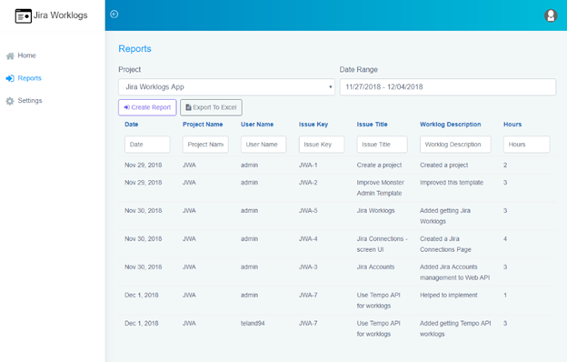

# JiraWorklogsApp

SPA (Single Page Application) that uses the Jira API to get Worklogs with multiple Jira Accounts.

## Used APIs, Frameworks and Libraries
  * ASP.NET Core 5.0 (Web API)
  * Entity Framework Core 5.0 with SQLite
  * Angular 11
  * Bootstrap 4
  * Monster Admin Template
  * Tempo API
  * ClosedXML
  * ClosedXML.Report
  * adal-angular4 (Azure AD Authentication)
  * Dapplo.Jira (Jira API)
  
## Reports Page

 

